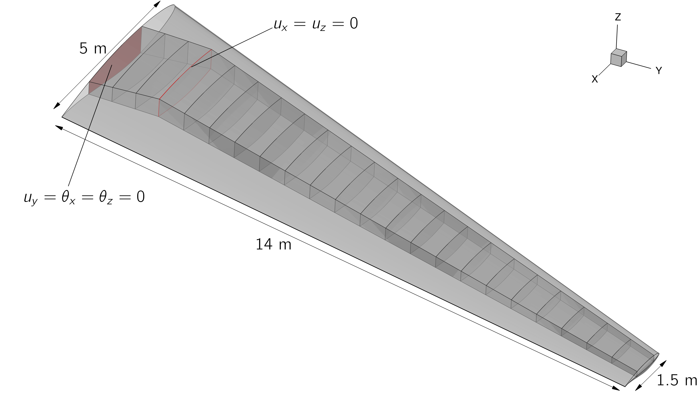
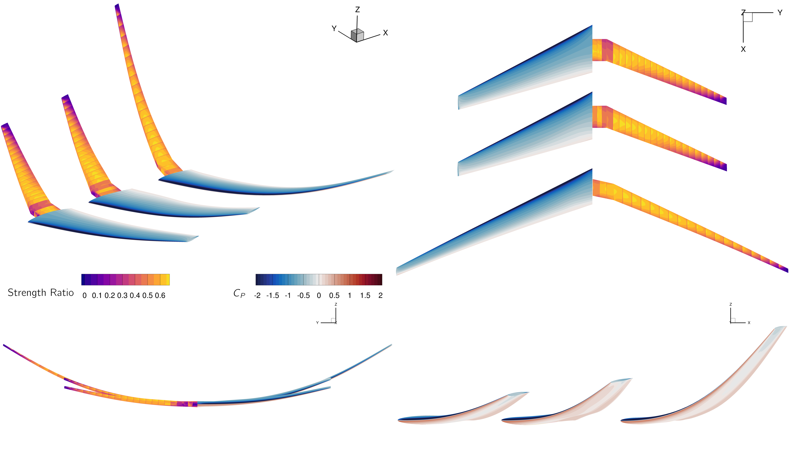

# MACH Tutorial Wing Repository

This repo contains files related to the "Simple Transonic Wing", a proposed benchmark model for the high-fidelity aeroelastic optimization community.

This model and the benchmark problems were originally published in our paper ["A Proposed Benchmark Model for Practical Aeroelastic Optimization of Aircraft Wings"](https://www.researchgate.net/publication/377154425_A_Proposed_Benchmark_Model_for_Practical_Aeroelastic_Optimization_of_Aircraft_Wings).
An up-to-date definition of the model and benchmark problems can be found in the pdf stored in this repo.

If you use this model and/or the benchmark problems in your research, please cite the paper, a bibtex entry is provided in `CITATION.bib`.

This repo includes:

- OML and wingbox CAD files
- Aerodynamic and structural meshes
- FFD control volumes
- Geometry and aircraft specifications

